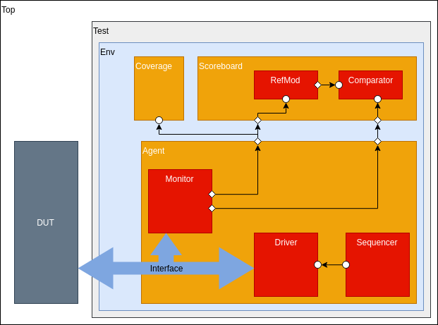

# Simple UVM

## Table of Contents

- [Getting Started](#getting-started)
- [Prerequisites](#prerequisites)
- [Running the tests](#running-the-tests)
- [Authors](#authors)
- [License](#license)
- [Contributing](#contributing)
- [Acknowledgments](#acknowledgments)

## Getting Started

Implements a simple UVM based testbench for a memory DUT. This repository is a basic UVM testbench with some features including reset on the fly using Phase Jumping.



### Prerequisites

```
UVM 1.2

Cadence xrun(64): 18.09-s011

or

Synopsys vcs version : O-2018.09
```

## Running the tests

To run the simulation just do the make command.

```
make
```

If you want to change the simulaltor just modify the symbolic link:

```
ln -s Makefile.spns Makefile
```

## Authors

* **José Iuri Barbosa de Brito** - [JoseIuri](https://github.com/JoseIuri)

See also the list of [contributors](https://github.com/your/project/contributors) who participated in this project.

## License

This project is licensed under the MIT License - see the [LICENSE.md](LICENSE.md) file for details

## Contributing

1. Fork it (<https://github.com/JoseIuri/Simple_UVM/fork>)
2. Create your feature branch (`git checkout -b feature/fooBar`)
3. Commit your changes (`git commit -am 'Add some fooBar'`)
4. Push to the branch (`git push origin feature/fooBar`)
5. Create a new Pull Request

## Acknowledgments

* XMEN Lab - Federal University of Campina Grande - Brazil

<p align="center">
  <a href="https://www.embedded.ufcg.edu.br/">
    
  </a>
</p>


